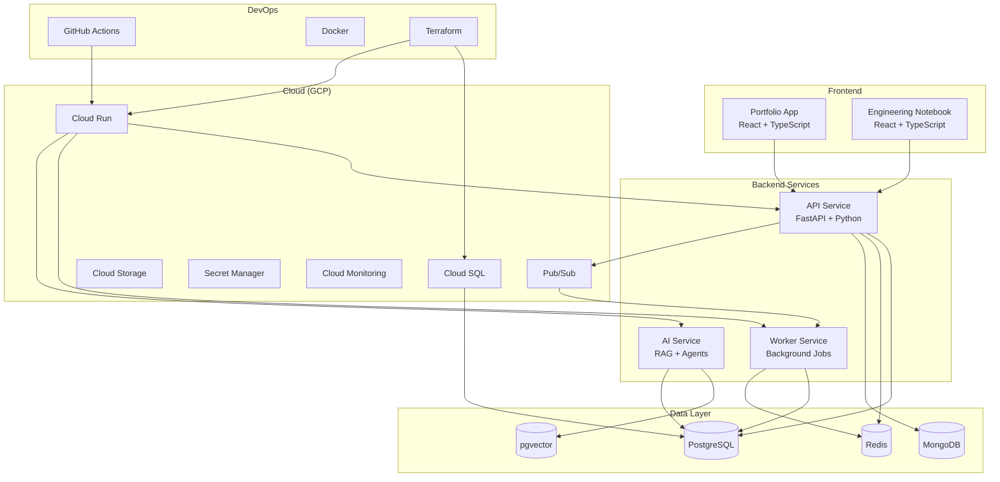
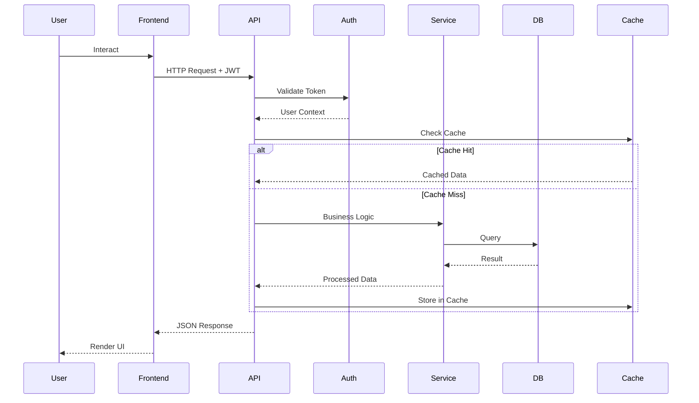
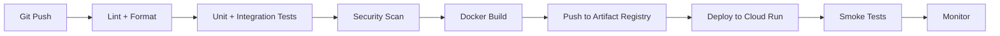

# System Architecture

## Overview
This is a monorepo containing a professional portfolio platform, engineering learning laboratory, 10 flagship projects, shared services, infrastructure-as-code, and internal engineering agents. The system demonstrates senior-level software engineering through real implementations.

## High-Level Architecture
The overall system has these major components:
1. **Portfolio App** (apps/portfolio/) — React + TypeScript SPA
2. **Engineering Notebook** (apps/notebook/) — React + TypeScript SPA (or section within portfolio)
3. **10 Flagship Projects** (projects/) — Each with its own architecture
4. **Shared Services** (services/) — API gateway, worker service, AI service
5. **Infrastructure** (infrastructure/) — Terraform, Docker, GCP configs
6. **Documentation** (docs/) — Architecture, system design, security, ADRs, interview notes
7. **Learning Material** (learning/) — Engineering notebook content organized by technology
8. **Engineering Agents** (agents/) — Internal AI agents for code review, architecture, testing, etc.

## Major Components

### Portfolio Application
- **Technology**: React 18+, TypeScript 5+, React Router v6, TanStack Query v5
- **Architecture**: Feature-based folder structure, lazy-loaded routes, error boundaries
- **State Management**: TanStack Query for server state, React Context for app state, local state via useState/useReducer
- **Styling**: Tailwind CSS (or similar utility-first)
- **Build**: Vite
- **Testing**: Vitest + React Testing Library + Playwright

### Engineering Notebook
- Could be a separate app or a major section of the portfolio app
- Content stored as structured markdown or JSON
- Rendered with syntax highlighting and interactive code blocks
- Organized by technology category

### API Service
- **Technology**: Python 3.12+, FastAPI, Pydantic v2, SQLAlchemy 2.0, Alembic
- **Architecture**: Clean/layered architecture — routes → services → repositories → models
- **Patterns**: Dependency injection, repository pattern, service layer
- **API Style**: RESTful with OpenAPI auto-documentation
- **Authentication**: JWT with refresh token rotation
- **Validation**: Pydantic models for all request/response schemas

### Worker Service
- Background job processing
- Consumes from Redis queues or GCP Pub/Sub
- Retry with exponential backoff + jitter
- Dead-letter queue for failed jobs
- Idempotent job execution

### AI Service
- RAG pipeline: document ingestion → chunking → embedding → vector storage → retrieval → reranking → generation
- Agent orchestration with tool calling
- MCP server for controlled tool access
- Evaluation pipeline
- Cost and latency tracking

## Data Flow
Here is how data flows through the system:
1. User interacts with Portfolio/Notebook frontend
2. Frontend makes API calls to FastAPI backend
3. API validates requests via Pydantic, processes via service layer
4. Services interact with PostgreSQL (relational data), MongoDB (analytics), Redis (cache)
5. Long-running tasks are published to Pub/Sub or Redis queues
6. Worker service processes background jobs
7. AI service handles RAG queries and agent interactions
8. All services emit structured logs and traces to GCP Monitoring

## Infrastructure

### Container Architecture
- Multi-stage Docker builds for minimal images
- Docker Compose for local development
- Separate Dockerfiles per service

### GCP Architecture
- Cloud Run for stateless services (API, Worker, AI)
- Cloud SQL for managed PostgreSQL
- Memorystore for managed Redis
- Cloud Storage for file uploads and static assets
- Pub/Sub for async messaging
- Secret Manager for secrets
- Artifact Registry for Docker images
- Cloud Monitoring + Logging for observability
- IAM with least-privilege service accounts

### CI/CD Pipeline

## Scaling Strategy
- **Horizontal**: Cloud Run auto-scales based on request concurrency
- **Database**: Connection pooling (pgbouncer/SQLAlchemy pool), read replicas for heavy read loads
- **Caching**: Redis for frequently accessed data, query result caching
- **Async**: Background processing for expensive operations
- **CDN**: Cloud CDN for static frontend assets

## Security Architecture
- Defense in depth
- Network: VPC, private services, firewall rules
- Application: Input validation, output encoding, CSRF/CORS, rate limiting
- Data: Encryption at rest (Cloud SQL), encryption in transit (TLS)
- Auth: JWT + refresh tokens, RBAC, least privilege
- Secrets: GCP Secret Manager, never in source code
- Dependencies: Automated vulnerability scanning in CI
- AI: Prompt injection prevention, output validation, tool sandboxing

## Observability Stack
- **Logs**: Structured JSON logging → GCP Cloud Logging
- **Metrics**: Custom metrics → GCP Cloud Monitoring
- **Traces**: OpenTelemetry → GCP Cloud Trace
- **Alerts**: GCP Alerting policies for SLO violations
- **Dashboards**: GCP Monitoring dashboards per service

## Technology Decisions
Reference ADR directory (docs/adr/) for detailed reasoning. Key decisions:
- Monorepo over multi-repo (ADR-001)
- React as primary frontend framework (ADR-002)
- FastAPI over Django/Flask (ADR-003)
- PostgreSQL as primary database (ADR-004)
- GCP over AWS/Azure (ADR-005)
- Cloud Run over GKE (ADR-006)
- Terraform for IaC (ADR-007)
