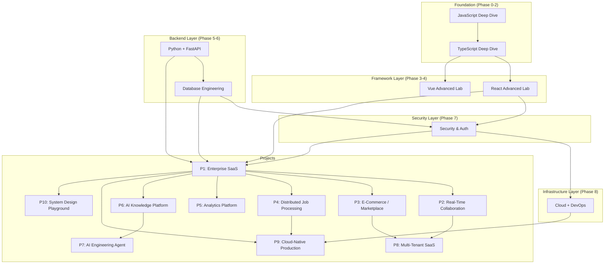

# Project Dependency Graph

> Shows which projects depend on which foundational knowledge and other projects.

## Dependency Philosophy

Projects are ordered so that each one builds on skills developed in previous projects. No project should require knowledge that hasn't been covered in an earlier phase or project.

## Dependency Diagram

## Project Build Order

The recommended implementation sequence, based on dependencies:

### Tier 1 — Foundational (build first)
| Order | Project | Dependencies | Skills Unlocked |
|-------|---------|-------------|-----------------|
| 1 | **Enterprise SaaS Platform** | React, TypeScript, Python, FastAPI, PostgreSQL, Redis, Auth | Full-stack fundamentals, RBAC, CRUD, testing, CI/CD |

### Tier 2 — Intermediate (requires Tier 1 skills)
| Order | Project | Dependencies | Skills Unlocked |
|-------|---------|-------------|-----------------|
| 2 | **Real-Time Collaboration** | P1 + WebSockets, Redis Pub/Sub | Real-time architecture, concurrency, distributed state |
| 3 | **E-Commerce / Marketplace** | P1 + Transactions, Events | Distributed workflows, idempotency, eventual consistency |
| 4 | **Distributed Job Processing** | P1 + Queues, Workers | Background processing, failure handling, observability |
| 5 | **Analytics Platform** | P1 + MongoDB, Aggregation | Data modeling, OLTP vs analytics, performance |

### Tier 3 — Advanced (requires Tier 2 skills)
| Order | Project | Dependencies | Skills Unlocked |
|-------|---------|-------------|-----------------|
| 6 | **AI Knowledge Platform** | P1 + LLMs, RAG, pgvector | AI engineering, RAG, evaluation, observability |
| 7 | **Multi-Tenant SaaS** | P1, P2, P3 + Tenant isolation | Multi-tenancy, advanced auth, scalability |

### Tier 4 — Expert (requires Tier 3 skills)
| Order | Project | Dependencies | Skills Unlocked |
|-------|---------|-------------|-----------------|
| 8 | **AI Engineering Agent** | P6 + Agents, MCP, Tools | Agentic AI, tool calling, memory, workflows |
| 9 | **Cloud-Native Production** | P1, P4 + GCP, Terraform, Docker | Production deployment, infrastructure as code |
| 10 | **System Design Playground** | All previous knowledge | System design, architecture, trade-offs |

## Key Dependency Rules

1. **P1 (Enterprise SaaS) must be built first** — it establishes all full-stack fundamentals
2. **P6 (AI Knowledge Platform) must precede P7 (AI Agent)** — RAG is a prerequisite for agent engineering
3. **P9 (Cloud-Native) should be one of the last** — it requires all DevOps and cloud knowledge
4. **P10 (System Design Playground) is built last** — it synthesizes all architectural knowledge
5. **Learning phases can overlap with project work** — Phase 1-2 (JS/TS) can happen alongside Phase 0
