# Technology Dependency Graph

> Maps technology learning dependencies — what must be learned before what.

## Core Dependency Flow

```mermaid
graph TD
    subgraph "Language Fundamentals"
        JS["JavaScript"]
        TS["TypeScript"]
        Py["Python"]
        SQL["SQL"]
        
        JS --> TS
    end

    subgraph "Frontend Frameworks"
        React["React"]
        Vue["Vue.js"]
        RTL["React Testing Library"]
        Vitest["Vitest"]
        Playwright["Playwright"]
        TanStack["TanStack Query"]
        
        TS --> React
        TS --> Vue
        React --> TanStack
        React --> RTL
        TS --> Vitest
        React --> Playwright
    end

    subgraph "Backend"
        FastAPI["FastAPI"]
        Pydantic["Pydantic"]
        SQLAlchemy["SQLAlchemy"]
        Alembic["Alembic"]
        Pytest["pytest"]
        
        Py --> FastAPI
        Py --> Pydantic
        FastAPI --> Pydantic
        Py --> SQLAlchemy
        SQLAlchemy --> Alembic
        Py --> Pytest
    end

    subgraph "Databases"
        PG["PostgreSQL"]
        Mongo["MongoDB"]
        Redis["Redis"]
        Supa["Supabase"]
        Fire["Firebase"]
        PGVector["pgvector"]
        
        SQL --> PG
        PG --> Supa
        PG --> PGVector
    end

    subgraph "Security"
        JWT["JWT"]
        OAuth["OAuth 2.0"]
        RBAC["RBAC"]
        OWASP["OWASP"]
        
        JWT --> OAuth
        JWT --> RBAC
    end

    subgraph "Infrastructure"
        Docker["Docker"]
        GCP["GCP"]
        Terraform["Terraform"]
        GHCI["GitHub Actions"]
        
        Docker --> GCP
        GCP --> Terraform
    end

    subgraph "System Design"
        Arch["Architecture Patterns"]
        Dist["Distributed Systems"]
        Cache["Caching"]
        Queue["Queues & Workers"]
        
        PG --> Arch
        Redis --> Cache
        Redis --> Queue
        Arch --> Dist
    end

    subgraph "Observability"
        Logging["Structured Logging"]
        Metrics["Metrics"]
        Tracing["Distributed Tracing"]
        OTel["OpenTelemetry"]
        
        Logging --> OTel
        Metrics --> OTel
        Tracing --> OTel
    end

    subgraph "AI Engineering"
        LLM["LLM Fundamentals"]
        Embed["Embeddings"]
        VectorDB["Vector Search"]
        RAG["RAG"]
        Agents["Agents"]
        MCP["MCP"]
        AIEval["AI Evaluation"]
        AISec["AI Security"]
        
        LLM --> Embed
        Embed --> VectorDB
        VectorDB --> RAG
        RAG --> Agents
        Agents --> MCP
        LLM --> AIEval
        LLM --> AISec
    end

    %% Cross-domain dependencies
    FastAPI --> JWT
    PG --> SQLAlchemy
    React --> OWASP
    FastAPI --> OWASP
    GCP --> Logging
    Docker --> GHCI
    PGVector --> VectorDB
```



## Technology Learning Sequence

### Stage 1: Language Foundations
```
JavaScript → TypeScript → Python → SQL
```
**Rationale**: JS/TS form the frontend foundation. Python is the backend language. SQL is required before any database work.

### Stage 2: Framework Proficiency
```
React → TanStack Query → Vue.js
FastAPI → Pydantic → SQLAlchemy → Alembic
```
**Rationale**: React first (primary framework), then Vue for comparison. FastAPI is the primary backend framework.

### Stage 3: Data Layer
```
PostgreSQL → MongoDB → Redis → Supabase → Firebase
```
**Rationale**: PostgreSQL is the primary database. Others build on relational understanding.

### Stage 4: Security
```
JWT → OAuth 2.0 → RBAC → OWASP Top 10
```
**Rationale**: Token-based auth is the foundation. OAuth adds federation. RBAC adds authorization. OWASP covers web security holistically.

### Stage 5: Infrastructure
```
Docker → GCP (Cloud Run, Cloud SQL) → GitHub Actions → Terraform
```
**Rationale**: Containerization first, then cloud platform, then CI/CD automation, then infrastructure as code.

### Stage 6: System Design & Production
```
Architecture Patterns → Distributed Systems → Caching → Queues
Structured Logging → Metrics → Tracing → OpenTelemetry
```
**Rationale**: Understand patterns before distributed concerns. Observability builds from simple to complex.

### Stage 7: AI Engineering
```
LLM Fundamentals → Embeddings → Vector Search → RAG → Agents → MCP
AI Evaluation (parallel with RAG)
AI Security (parallel with Agents)
```
**Rationale**: Each AI concept builds on the previous. Evaluation and security are cross-cutting.

## Technology Groupings for Interview Preparation

| Group | Technologies | Interview Focus |
|-------|-------------|----------------|
| Frontend | JavaScript, TypeScript, React, Vue | Language mechanics, framework internals, state management, performance |
| Backend | Python, FastAPI, Pydantic | API design, async, validation, middleware, DI |
| Data | PostgreSQL, MongoDB, Redis, SQL | Schema design, indexing, transactions, caching, consistency |
| Security | JWT, OAuth, RBAC, OWASP | Auth flows, vulnerability classes, secure design |
| Cloud/DevOps | Docker, GCP, Terraform, GitHub Actions | Containerization, cloud services, IaC, CI/CD |
| Architecture | System Design, Distributed Systems | Scalability, trade-offs, failure handling, capacity planning |
| AI | LLMs, RAG, Agents, MCP, Evaluation | RAG architecture, agent design, evaluation, security |
