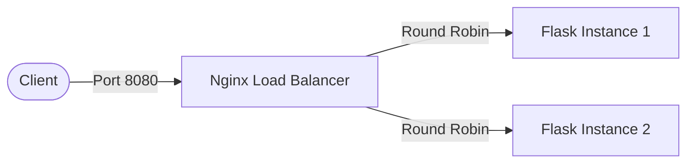

# Load Balancing with Nginx

This project is a hands-on system design demonstration of horizontal scaling, where Nginx routes traffic to multiple identical Flask application instances. It illustrates how a load balancer can distribute incoming network traffic across a group of backend servers.

## Why it matters
In modern system design, a single server often cannot handle the load of a large application. Horizontal scaling (adding more machines) is the standard way to increase capacity and reliability. A load balancer acts as the "traffic cop" sitting in front of your servers and routing client requests across all servers capable of fulfilling those requests in a manner that maximizes speed and capacity utilization.

## Architecture

Nginx acts as a reverse proxy and load balancer.



## Concepts Covered
- **Horizontal Scaling:** Scaling by adding more machines to your pool of resources.
- **Statelessness:** The Flask app does not store any client state, meaning any request can be routed to any instance.
- **Round-Robin Load Balancing:** The default Nginx algorithm that sends requests sequentially to the servers in the upstream pool.
- **Reverse Proxy:** Nginx receives the client request, forwards it to the backend server, and returns the server's response to the client.

## How to Run

Requirements: Docker and Docker Compose installed.

1. Bring up the infrastructure:
   ```bash
   docker compose up --build
   ```

2. The load balancer will be available at `http://localhost:8080`.

## How to Test

You can test the load balancing by making multiple requests to the API.

```bash
# Test the main endpoint
curl http://localhost:8080/
```

You should see the `server` value alternate between `instance-1` and `instance-2` (round-robin):
```json
{"server": "instance-1", "message": "hello"}
{"server": "instance-2", "message": "hello"}
```

```bash
# Test the health check endpoint
curl http://localhost:8080/health
```
